## Installation deux site web sur UBUNTU en utilisant APACHE

Pour Installation  je vais utiliser Ubuntu 18.04 installé sur  vmware workstation, carte réseau je vais configurer en mode bridge pour avoir accès à partir de MobaXterm. Pour vérifier accès à des sites web je vais utiliser Raspberry Pi qui est dans le même réseau.  Pour installer quelques sites sur un serveur on va configurer les virtual hosts sur Apache.

Premièrement il faut  faire une mise à jour de votre système:

olex@ubuntu:\~\$ sudo apt update && sudo apt upgrade -y

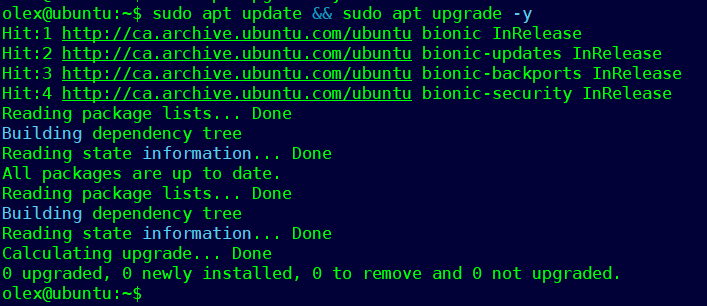

### Installation Apache

olex@ubuntu:\~\$ sudo apt-get install apache2

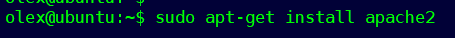

Pour installer quelques sites web sur le même serveur il faut créer quelques dossiers. Je vais creer 2: site 1 et site 2.

olex@ubuntu:\~\$ sudo mkdir -p /var/www/site1.com/public\_html

olex@ubuntu:\~\$ sudo mkdir -p /var/www/site2.com/public\_html

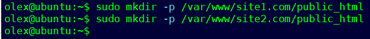

 Il faut changer droit accès pour current user

olex@ubuntu:\~\$ sudo chown -R \$USER:\$USER /var/www/site1.com/public\_html

olex@ubuntu:\~\$ sudo chown -R \$USER:\$USER /var/www/site2.com/public\_html

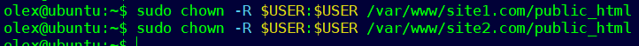

 Pour que les sites soient accessibles aux utilisateurs dans le navigateur, vous devez autoriser la lecture des fichiers dans ces répertoires

olex@ubuntu:\~\$ sudo chmod -R 755 /var/www

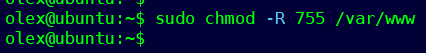

On va créer deux  index.html pour faire la vérification et bien identifier chaque site.

olex@ubuntu:\~\$ sudo vim /var/www/site1.com/public\_html/index.html

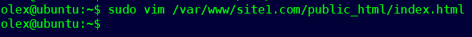

Et ajouter texte suivante:

 \<html\>

  \<body\>

    This is our site1.com website

  \</body\>

\</html\>

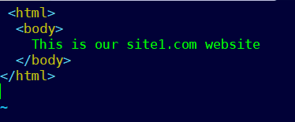

Pour site2.com il faut faire meme chose:

olex@ubuntu:\~\$ sudo vim /var/www/site2.com/public\_html/index.html

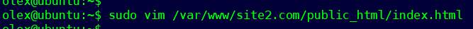

 

Et ajouter texte suivante:

\<html\>

  \<body\>

    This is our site2.com website

  \</body\>

\</html\>

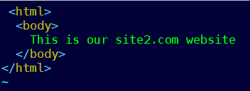

Creation new virtual hosts files.

Apres installation, Apache crée le configuration file par défaut dans le dossier /etc/apache2/sites-available/000-default.conf

On va copier se file  pour chaque site avec extension .conf

olex@ubuntu:\~\$ sudo cp /etc/apache2/sites-available/000-default.conf /etc/apache                          2/sites-available/site1.com.conf

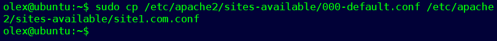

olex@ubuntu:\~\$ sudo cp /etc/apache2/sites-available/000-default.conf /etc/apache                          2/sites-available/site2.com.conf

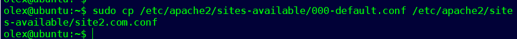

On va configurer ses fils:

olex@ubuntu:\~\$ sudo vim /etc/apache2/sites-available/site1.com.conf

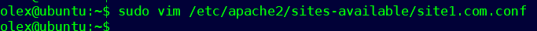

Il faut ajouter/corriger information suivantes:

    ServerAdmin admin@site1.com

    ServerName site1.com

    ServerAlias www.site1.com

    DocumentRoot /var/www/site1.com/public\_html

   

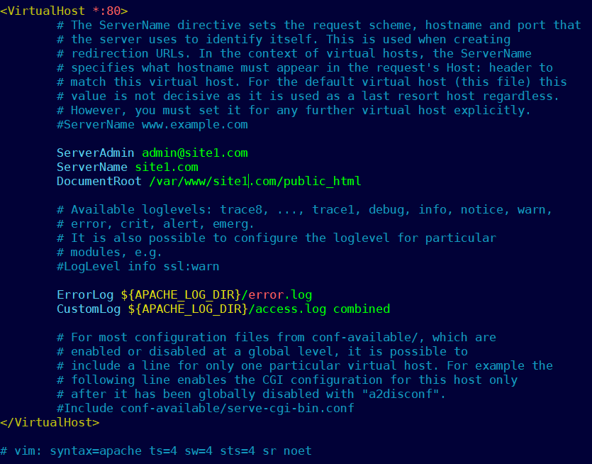

Pour site2.com il faut faire meme chose

olex@ubuntu:\~\$ sudo vim /etc/apache2/sites-available/site2.com.conf

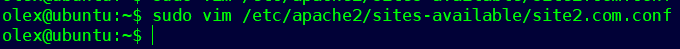

Il faut ajouter/corriger information suivantes:

    ServerAdmin admin@site2.com

    ServerName site2.com

    ServerAlias www.site2.com

    DocumentRoot /var/www/site2.com/public\_html

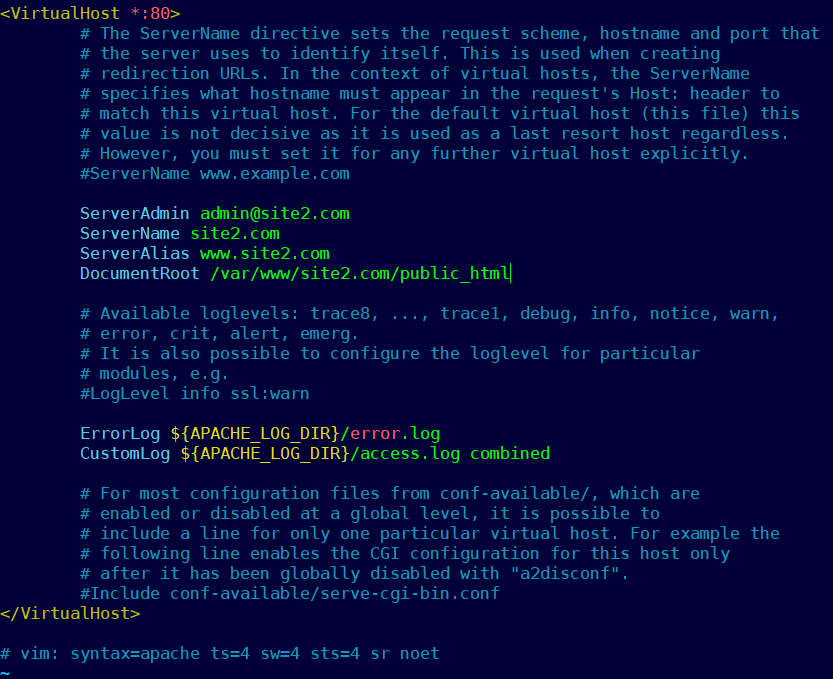

Nous avons créé des fichiers de configuration pour les hôtes virtuels. Maintenant, vous devez les activer :

sudo a2ensite site1.com.conf

sudo a2ensite site2.com.conf

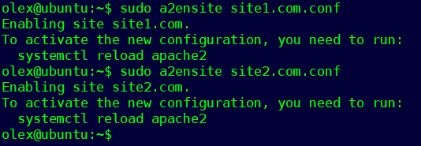

Restart Apache

olex@ubuntu:\~\$ sudo service apache2 restart

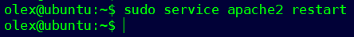

Verification FW

Vous devez vérifier que votre pare-feu autorise le trafic HTTP et HTTPS:

olex@ubuntu:\~\$ sudo ufw app list

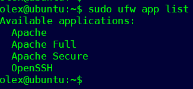

Vérification du profil Apache Full, il devrait autoriser le trafic pour les ports 80 et 443 :

olex@ubuntu:\~\$ sudo ufw app info "Apache Full"

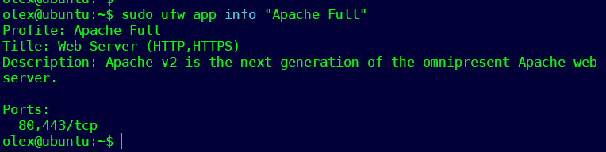

### Verification Apache

Pour vérifier Apache  il faut taper adresse ip dans votre browser

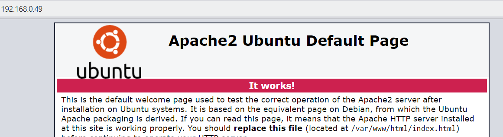

Si vous voyez cette page, votre serveur Web est correctement installé et accessible via un pare-feu.

Verification  d'accès de site1.com et site2.com

Parce que ses sites sont créés pour le test et  on pas enregistrer les domain name, pour vérification on va configurer host file ordinateur local. Si vous utiliser Windows:

C:\\windows\\system32\\drivers\\etc\\hosts

Pour linux il faut corriger

/etc/hosts

Il faut ajouter :

xxx.xxx.xxx.xxx site1.com

xxx.xxx.xxx.xxx site2.com

(xxx.xxx.xxx.xxx adresse IP votre serveur web)

Dans mon cas cela:

192.168.0.49 site1.com

192.168.0.49 site2.com

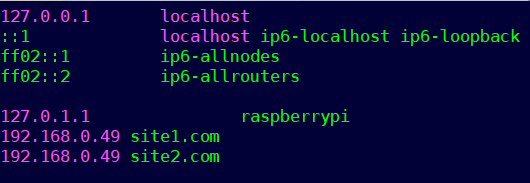

Et les resultats:

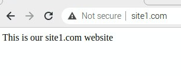

et

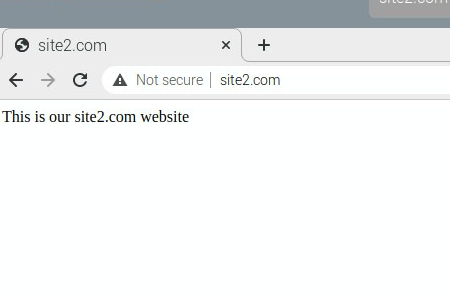

