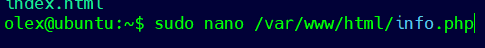

Installation LAMP pour installation de CMS (Joomla et Wordpress)
----------------------------------------------------------------

Dans [l'article précédent](https://oleks.ca/2021/06/27/installation-de-deux-sites-web-sur-ubuntu-en-utilisant-apache/), nous avons mis deux sites Web sur un serveur en utilisant Apache. Pour le test, nous avons utilisé deux sites Web simples créés en html. Maintenant on va installer les sites Web en utilisant le CMS. Alors installons un site sur WordPress et un autre sur Joomla.

Pour installer CMS comme WordPress ou Joomla il faut installer LAMP (Linux, Apache, MySQL, PHP). Jn a déjà installé Apache et il nous reste à installer MySQL et PHP et faire la configuration d'Apache. On va commencer l’installation de MySQL.

#### Installation de MySQL

*olex@ubuntu:\~\$ sudo apt install mysql-server*

Configurer le plugin de validation de mot de passe

*olex@ubuntu:\~\$ sudo mysql\_secure\_installation*

Pour toutes les questions suivantes, entrez simplement Y et appuyez sur la touche ENTER pour sélectionner les paramètres par défaut. Cela supprimera certains utilisateurs et bases de données de test, désactivera l'accès à distance avec le compte d'utilisateur root et appliquera immédiatement toutes les modifications à MySQL.

#### Installation de PHP 

PHP est un composant qui traitera le code pour rendre le contenu dynamique. Nous installerons également des packages auxiliaires afin que le code PHP puisse fonctionner avec notre serveur Apache, ainsi qu'accéder à la base de données MySQL.

*olex@ubuntu:\~\$ sudo apt install php libapache2-mod-php php-mysql*

Pour que notre serveur Web préfère les fichiers PHP, nous allons donc configurer Apache pour rechercher d'abord les fichiers index.php.

On va corriger le fichier:

*olex@ubuntu:\~\$ sudo nano /etc/apache2/mods-enabled/dir.conf*

Il faut déplacer le fichier d'index PHP *index.php* à la première place après la spécification *DirectoryIndex* comme ceci:

Après cela, nous devons redémarrer Apache pour appliquer les modifications.

Vérifier l'état du service *apache2* à l'aide de *systemctl*

Pour verification de PHP on va créer *info.php* dans */var/www/html/*

On va ajouter:

\*<?php*

*phpinfo();*

*?\>*

Après on va aller à:

*http://IP_serveur/info.php*

Et voilà, le serveur PHP fonctionne:

#### Installation de PHPMyAdmin

L’installation de PHPMyAdmin n’est pas du tout obligatoire mais cela nous facilitera la vie.

*olex@ubuntu:\~\$ sudo apt install phpmyadmin*

Choisissez d’utiliser *PHPMyAdmin* pour un serveur Apache.

Lorsqu'on lui demande si *dbconfig-common* doit être utilisé pour configurer la base de données, sélectionnez *Oui*.

Pour le mot de passe root, il s’agit de celui que vous avez utilisé pour MySQL.

Vous pouvez choisir *password*. Il vaut mieux utiliser un mot de passe fort!

Le processus d'installation ajoutera le fichier de configuration de phpMyAdmin au répertoire */etc/apache2/-enabled/*, où il sera lu automatiquement. Tout ce que vous avez à faire est d'activer explicitement l'extension PHP *mbstring*, ce qui peut être fait avec la commande suivante :

*olex@ubuntu:\~\$ sudo phpenmod mbstring*

Après il faut redémarrer Apache:

*olex@ubuntu:\~\$ sudo systemctl restart apache2*

#### Configuration de l'accès par mot de passe pour le compte root dans MySQL

Pour vous connecter à phpMyAdmin avec l'utilisateur root MySQL, vous devez changer la méthode d'authentification de auth\_socket à mysql\_native\_password si vous ne l'avez pas déjà fait. Pour ce faire, ouvrez une ligne de commande MySQL via un terminal:

*olex@ubuntu:\~\$ sudo mysql*

Après, avec la commande suivante, il faut vérifier quelle méthode d'authentification de vos comptes d'utilisateur MySQL utilise:

*mysql\> SELECT user,authentication\_string,plugin,host FROM mysql.user;*

L'utilisateur root utilise en fait la méthode d'authentification en utilisant le plugin auth\_socket. Pour configurer l'authentification par mot de passe pour le compte de root, exécutez la commande ALTER USER suivante.

*mysql\> ALTER USER 'root'@'localhost' IDENTIFIED WITH mysql\_native\_password BY 'MyPass';*

Pour appliquer les modification, exécutez la commande FLUSH PRIVILEGES:

*mysql\> FLUSH PRIVILEGES;*

Vérifiez les méthodes d'authentification pour confirmer que l'utilisateur de root n'utilise plus le plug-in *auth\_socket*:

*mysql\> SELECT user,authentication\_string,plugin,host FROM mysql.user;*

Vous pouvez désormais accéder à l'interface web en tapant le nom de domaine ou l'adresse IP publique de votre serveur et en ajoutant */phpmyadmin* :

J'ai utilisé un utilisateur root mais il vaut mieux créer un utilisateur séparé!

Vous devez également configurer le fichier *.htaccess* pour augmenter la sécurité.

Le serveur est maintenant prêt à installer le CMS.

